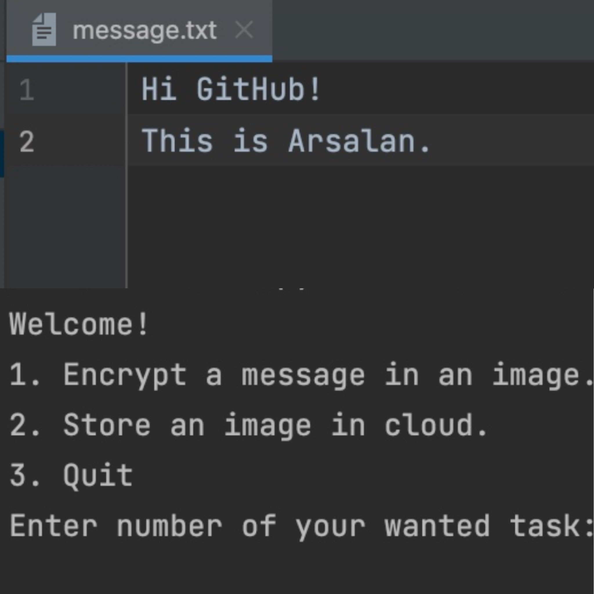

# Image-Steganography-LSB

Image-Steganography-LSB is a command-line application that enables users to perform steganography using the Least Significant Bit (LSB) algorithm on images. This technique allows you to hide sensitive information within image files in a way that is not detectable by the human eye.




## Table of Contents

- [Introduction](#introduction)
- [Project Overview](#project-overview)
- [Features](#features)
- [Getting Started](#getting-started)
- [Conclusion](#conclusion)

## Introduction

Welcome to the Image-Steganography-LSB repository! This project aims to provide an intuitive and user-friendly tool for hiding information within image files using the LSB algorithm. Steganography is an art of covert communication, and LSB steganography involves replacing the least significant bit of pixel values with hidden data, making it imperceptible to casual observers.


## Project Overview

The Image-Steganography-LSB application allows you to perform steganography using the Least Significant Bit (LSB) algorithm on images through a simple and interactive console interface. By leveraging the LSB algorithm, this application enables you to hide text-based information within image files, without perceptible changes to the image's appearance.

### Steganography Principles

Steganography is the practice of concealing one piece of information within another, often to protect the secrecy of the hidden content. In the context of image steganography, the goal is to hide information within the image in a way that is undetectable to human observers. This is achieved by making subtle alterations to the image's pixel values, which the human eye typically doesn't perceive.

### LSB Algorithm

The Least Significant Bit (LSB) algorithm is a widely used technique in image steganography. It operates on the principle that changing the least significant bit of a pixel value has minimal impact on the image's visual appearance. In digital images, pixel values are typically represented as binary values. The LSB is the rightmost bit in this binary representation.

The LSB algorithm works as follows:

1. **Embedding**: To hide a bit of information (0 or 1) within an image, the LSB of the pixel value is modified to match the bit of the hidden message. This slight change is often imperceptible to human observers.

2. **Extracting**: To retrieve the hidden information, the LSB of the pixel values is examined. The extracted bits are then combined to reconstruct the hidden message.

By altering the LSB of pixel values, the LSB algorithm allows for the concealment of information without introducing significant visual distortion. However, it's important to note that excessive alterations to the LSBs might lead to cumulative distortion, potentially affecting the image's overall quality.

This project provides an interactive way to experience the principles of steganography and the functionality of the LSB algorithm, showcasing the balance between hiding information and maintaining image fidelity.

The console interface offers the following options:

1. **Encrypt a message in an image**: This option allows you to embed a text-based message within an image using the LSB algorithm. The message becomes hidden within the image's pixel values. To use this feature:

   - Update `message.txt`: Before selecting this option, ensure that the message you want to hide is placed in the `message.txt` file in the project directory.
   - Set a password: The application will prompt you to enter a password. This password is used to encrypt the hidden message.
   - New image creation: After successfully embedding the message, a new image file named `encrypted_<pic-name>.jpeg` will be generated in the directory, where `<pic-name>` is the name of the original image file.

2. **Decrypt a message from an image**: This option allows you to retrieve a hidden message from an encrypted image. To use this feature:

   - Enter the password: The application will prompt you to enter the password you set during the encryption process.
   - Message extraction: Upon successful authentication, the hidden message will be extracted from the encrypted image.
   - Output file: The extracted message will be saved in a file named `<pic-name>_export.txt`, where `<pic-name>` is the name of the original image file.

3. **Quit**: This option allows you to exit the application.

Please choose the desired task by entering the corresponding number. The project emphasizes the responsible and ethical use of technology for steganography while respecting privacy and legal boundaries. Always handle passwords and hidden information securely.

## Features

- **Text Embedding**: Seamlessly embed textual data into image files.
- **Image Extraction**: Extract hidden text from steganographically modified images.
- **User-Friendly TUI**: Enjoy a simple and interactive text-based user interface (TUI) for ease of use.
- **Compatible Image Formats**: Support for common image formats like PNG, JPEG, and BMP.
- **Customizable LSB Depth**: Adjust the number of least significant bits altered to balance data capacity and image distortion.

## Getting Started

To use the Image-Steganography-LSB application, follow these steps:

1. **Clone the Repository**: Clone this repository to your local machine using the following command:

   ```bash
   git clone https://github.com/arsalanjabbari/Image-Steganography-LSB.git
   ```

2. **Navigate to the Directory**: Move into the project directory:

   ```bash
   cd Image-Steganography-LSB
   ```

3. **Install Dependencies**: Install any necessary dependencies. For example:

   ```bash
   pip install cv2, numpy
   ```

4. **Run the Application**: Execute the application by running:

   ```bash
   python main.py
   ```

5. **Follow the TUI**: The TUI will guide you through the process of embedding and extracting text in/from images using the LSB algorithm.

## Conclusion

Image-Steganography-LSB provides a valuable tool for concealing information within images while maintaining visual integrity. By leveraging the power of the LSB algorithm, this project demonstrates how technology can be used creatively for covert communication. Feel free to explore, experiment, and contribute to enhance the capabilities of this image steganography application.

If you encounter any issues, have suggestions, or want to contribute, don't hesitate to open an issue or submit a pull request. Happy coding and steganographing!

**Note**: Remember that while steganography can be fun and educational, it's important to use technology responsibly and ethically. Always respect privacy and legal boundaries when working with hidden information.